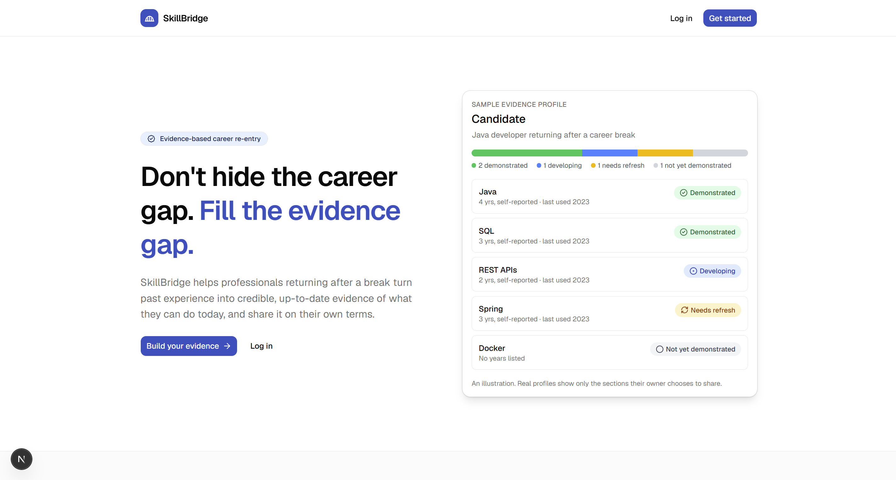
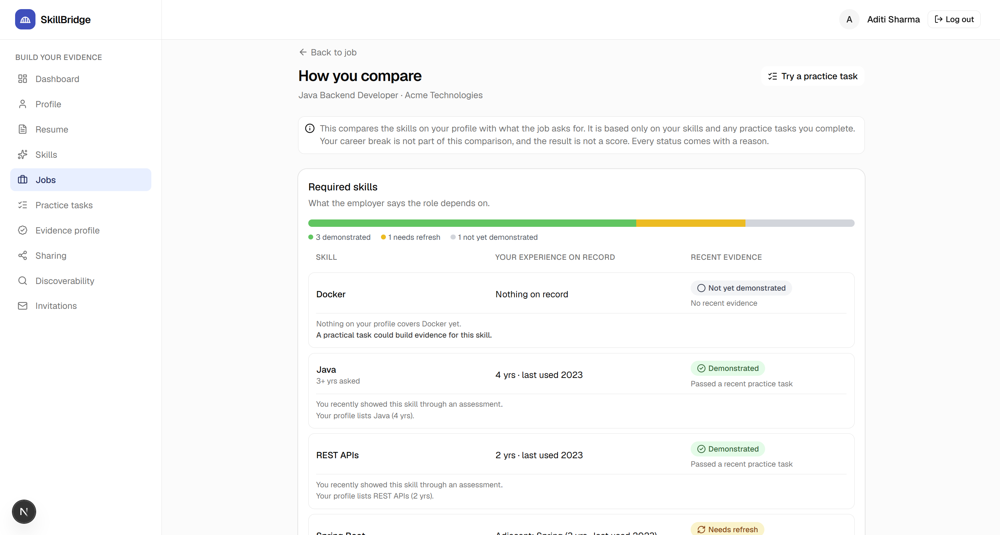
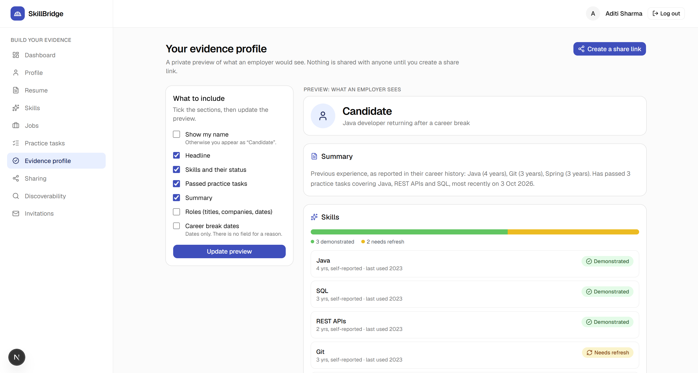
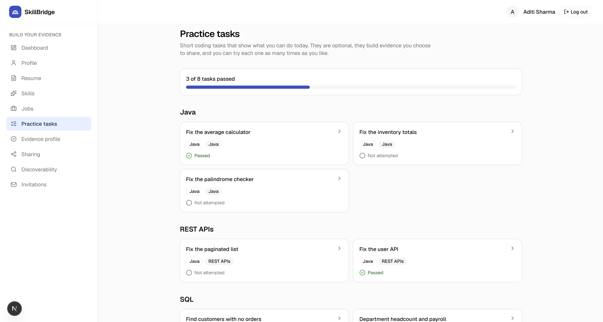
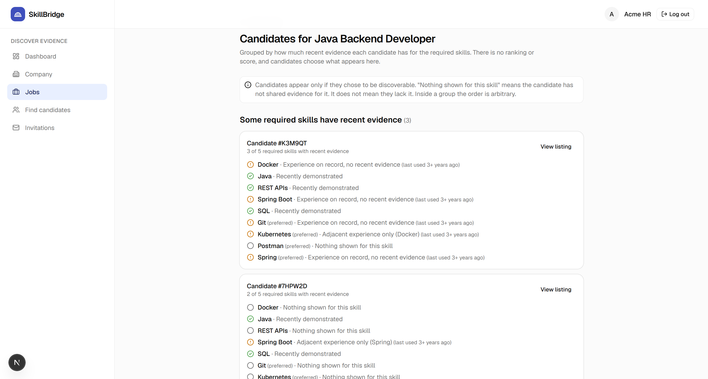

# SkillBridge

**Don't hide the career gap. Fill the evidence gap.**

SkillBridge is an evidence-based career re-entry platform. It helps professionals returning after a career break turn past experience into credible, up-to-date evidence of what they can do today, and lets employers review that evidence alongside the résumé.

---

## Project Overview

### Problem Statement

Career breaks are common: caregiving, maternity, relocation, health, study, and many other reasons. A break does not erase a person's experience, but it does create an **evidence gap**. A résumé shows where a professional has been, not what they can do today, especially when tools, versions and job requirements have changed during the break.

Existing options each solve only part of the problem:

| Existing approach | Limitation |
|---|---|
| Résumés | Show history, with little evidence of current capability |
| Job portals | Focus on discovery and applications |
| Online courses and certificates | Completion does not show how someone performs on a real task |
| Coding platforms | Not designed for career re-entry |
| Returnship programmes | Often tied to particular companies |
| Skills audits | Identify skills but rarely produce current, practical evidence |

Nothing connects **past experience → a target job → current evidence → employer understanding**, and a single opaque "job readiness score" would only add to the bias career returners already face.

### Proposed Solution

SkillBridge is a two-sided platform built around one pipeline:

```
Past experience → Target job → Required skills → Skill gap → Practical evidence → Evidence profile → Employer review
```

- A **candidate** uploads a résumé. AI extracts roles and skills, and the candidate reviews and corrects everything before it is saved. She picks a target job and sees, skill by skill, what her history covers and what has recent evidence. She completes short practice tasks, then shares an evidence profile that shows exactly the sections she chooses.
- An **employer** posts a job. AI extracts its requirements, and the employer reviews them before publishing. The employer then finds candidates who chose to be discoverable, grouped by the evidence they have for that job, and invites them. Contact details are shared only if the candidate accepts.

Design principles that shape every feature:

1. **A career break is not a score.** The break never enters a skill comparison, a search filter or a sort, and there is no field for a reason.
2. **No single readiness score.** Every status comes with a plain-language reason.
3. **AI assists, people decide.** AI output is validated and shown for review. Employers make every hiring decision.
4. **The candidate is in control.** Nothing is visible until she shares it, and she can revoke it at any time.
5. **Assessments are optional evidence-building tools**, not gatekeeping.

### Features

**Candidate**

- Role-based sign-up and login, with a profile of roles, headline and career-break dates (dates only).
- Résumé upload (private PDF storage), text extraction, and AI extraction of roles, dates and skills, validated against a strict schema.
- A review screen where the candidate corrects or removes anything the AI got wrong. Nothing is saved until she confirms. Possible career breaks are detected from role dates and are only suggestions.
- Skills page with provenance (from résumé, edited, or added by the candidate).
- Browse published jobs and choose up to five target jobs.
- **Skill-gap analysis** against a job: four statuses (Demonstrated, Developing, Needs refresh, Not yet demonstrated) with reasons, shown as "experience on record" versus "recent evidence".
- **Practice tasks** in Java debugging, REST fundamentals and SQL, graded in a sandbox against hidden test cases, with per-case feedback.
- **Evidence profile**: a live preview of what an employer would see, built from her data and her chosen sections, with a career timeline and a skills-by-status chart.
- **Share links** with unguessable tokens, an expiry date, an audience choice and a revoke button, plus an activity page showing who viewed her profile.
- **Discoverability** (off by default): employers see only a short public code and the sections she chooses.
- **Invitation inbox**: accept (shares her name and email with that employer only), decline, or block a company.
- Dashboard with stats, a getting-started checklist, a skills-by-status bar and a practice-activity chart.

**Employer**

- Company profile and job management (draft, published, closed).
- **AI requirement extraction** from a pasted job description, with a review screen to mark each skill required or preferred and set minimum years.
- **Find candidates for a job**: grouped by recent evidence, with a tick-and-warning breakdown per skill. There is no ranking or score, and the order inside a group is arbitrary.
- Candidate listings showing only what the candidate shares, with every view logged for the candidate.
- **Invitations** with a message (no links or email addresses), a daily limit and one invitation per candidate and job. Contact details appear only after acceptance.
- Dashboard with job and invitation counts and a most-requested-skills chart.

**Platform**

- Responsive interface with a sidebar shell, mobile menu, unread badges and accessible status badges.
- A shared skill taxonomy with aliases and relations, so "REST", "RESTful APIs" and "REST API design" are one skill, and MySQL counts toward SQL.
- Unit tests for the gap engine, grading, matching, privacy rules and invitation rules, with CI on every push.

### Deployment link

<!-- Add your deployment link -->
`<deployment-link>`

### Screenshots 

**SkillBridge landing page.** The entry point for candidates and employers, introducing the idea of hiring based on verified evidence instead of resume claims.



**Skill-gap analysis.** Each skill shows what her history covers next to what has recent evidence.



**Evidence profile.** What an employer sees, built only from the sections the candidate shares.



**Practice task workspace.** Sample cases, a code editor and graded results. Hidden cases show only a verdict.



**Employer candidate search.** Candidates grouped by evidence for a job, with no score or ranking.



---

## Technical Details

### Technologies / Tech Stack Used

| Layer | Technology |
|---|---|
| Frontend | Next.js 15 (App Router), React 19, TypeScript, Tailwind CSS 4, shadcn/ui, Lucide icons |
| Backend | Next.js server actions and route handlers, Auth.js (credentials, JWT sessions), bcrypt, Zod validation |
| Database | PostgreSQL 16 with Prisma ORM (migrations and seed data) |
| AI | Google Gemini API with structured JSON output, validated by Zod before use |
| Code execution | Piston, a sandboxed code runner in Docker (Java and Python) |
| PDF handling | unpdf (text extraction) |
| Testing and tooling | Vitest, ESLint, TypeScript, GitHub Actions CI, Docker Compose |

**External APIs:** Gemini API (résumé and job-description extraction) and the Piston REST API (`/api/v2/execute`) for sandboxed grading.

### Project Structure

```
skillbridge/
├── prisma/
│   ├── schema.prisma            # data model
│   ├── migrations/              # database history
│   ├── seed.ts                  # demo accounts, taxonomy, practice tasks, a published job
│   └── seed-demo.ts             # extra demo candidates with evidence
├── src/
│   ├── app/
│   │   ├── page.tsx             # landing page
│   │   ├── login/ register/     # authentication screens
│   │   ├── candidate/           # dashboard, profile, resume, review, skills, jobs (+ gap),
│   │   │                        #   tasks, evidence, share, discovery, invitations
│   │   ├── employer/            # dashboard, company, jobs (+ review, candidates),
│   │   │                        #   candidate search, invitations
│   │   ├── p/[token]/           # shared evidence profile (employer-facing)
│   │   ├── actions/             # server actions (auth, jobs, resume, tasks, share, invitations...)
│   │   └── api/                 # auth handler and private résumé download
│   ├── components/
│   │   ├── ui/                  # shadcn/ui components
│   │   ├── shell/               # app shell: sidebar, mobile menu, badges
│   │   ├── charts/              # status bar, timeline, bar and activity charts
│   │   └── profile/ discovery/ share/ auth/
│   ├── lib/
│   │   ├── ai/                  # Gemini client and output schemas
│   │   ├── skills/              # taxonomy, skill resolver, gap engine, date parsing, gap detection
│   │   ├── grading/             # Piston runner, SQL harness, judging, evidence recording
│   │   ├── tasks/               # practice task library and reference solutions
│   │   ├── profile/             # shared-profile builder, timeline, share settings
│   │   ├── share/               # tokens, access rules, view logging
│   │   ├── discovery/           # matching, grouping, loaders
│   │   ├── invitations/         # message rules, inbox helpers
│   │   └── dashboard/           # dashboard data loaders
│   ├── auth.ts auth.config.ts middleware.ts   # authentication and role-based route protection
│   └── types/
├── tools/
│   └── verify-tasks.ts          # proves every practice task is fair (reference solution passes, starter fails)
├── docker-compose.yml           # local PostgreSQL
├── .env.example                 # required environment variables
└── .github/workflows/ci.yml     # lint, type-check and tests on every push
```

---

## Getting Started

### Installation & Setup Instructions

**Prerequisites:** Node.js 20 or newer, pnpm, Docker Desktop and Git. A Gemini API key (free from [Google AI Studio](https://aistudio.google.com/apikey)) is needed for the AI features.

1. **Clone and install**

```bash
   git clone <your-repository-url>
   cd skillbridge
   pnpm install
```

2. **Configure the environment.** Copy the example file and fill in the values:

```bash
   cp .env.example .env        # on Windows PowerShell: Copy-Item .env.example .env
```

   | Variable | Purpose |
   |---|---|
   | `DATABASE_URL` | PostgreSQL connection string used by the app |
   | `DIRECT_URL` | Direct connection string used by Prisma migrations (the same as `DATABASE_URL` locally) |
   | `AUTH_SECRET` | Secret that signs sessions. Generate one with `openssl rand -base64 32` |
   | `GEMINI_API_KEY` | Your Gemini API key |
   | `GEMINI_MODEL` | Gemini model to use (see `.env.example`) |
   | `PISTON_URL` | Address of the code runner, `http://localhost:2000` by default |

3. **Start the database**

```bash
   docker compose up -d
```

4. **Create the tables and load demo data**

```bash
   pnpm prisma migrate deploy
   pnpm prisma db seed
```

5. **Start the code runner (needed for practice-task grading).** Piston needs a privileged container:

```bash
   docker run --privileged -v piston_data:/piston --tmpfs /piston/jobs -dit -p 2000:2000 --name piston_api ghcr.io/engineer-man/piston
```

   Then install the two language runtimes it uses. List the available versions with `GET http://localhost:2000/api/v2/packages` and install one Java and one Python version. Example (PowerShell):

```powershell
   Invoke-RestMethod -Method Post -Uri http://localhost:2000/api/v2/packages -ContentType "application/json" -Body '{"language":"java","version":"15.0.2"}'
   Invoke-RestMethod -Method Post -Uri http://localhost:2000/api/v2/packages -ContentType "application/json" -Body '{"language":"python","version":"3.12.0"}'
```

   Example (macOS or Linux):

```bash
   curl -X POST http://localhost:2000/api/v2/packages -H "Content-Type: application/json" -d '{"language":"java","version":"15.0.2"}'
   curl -X POST http://localhost:2000/api/v2/packages -H "Content-Type: application/json" -d '{"language":"python","version":"3.12.0"}'
```

   Use the versions your Piston lists. After a restart, start it again with `docker start piston_api`.

### How to Run the Project

```bash
pnpm dev          # development server at http://localhost:3000
```

For a faster, production-like run:

```bash
pnpm build
pnpm start
```

**Demo accounts** (created by the seed, for local use only, password `password123`):

| Role | Email | Notes |
|---|---|---|
| Candidate | `aditi@example.com` | Java developer returning after a career break, the main demo story |
| Employer | `hr@acme.example.com` | Company with a published Java Backend Developer job |
| Candidates | `meera@`, `rohan@`, `sunita@`, `kavya@`, `arjun@`, `lakshmi@`, `neha@example.com` | Discoverable candidates with different amounts of evidence (Lakshmi has discovery switched off) |

**Other commands**

```bash
pnpm test             # unit tests
pnpm typecheck        # TypeScript check
pnpm lint             # ESLint
pnpm tasks:verify     # runs every practice task's reference solution and starter code through Piston
pnpm prisma studio    # browse the database
```

---

## Security notes

- **Authentication and access:** passwords are hashed with bcrypt. Routes are protected by role in middleware, and every action re-checks that the signed-in user owns the record it touches.
- **Private files:** résumés are stored outside the public folder and served only to their owner.
- **AI output is untrusted:** it is validated against a strict schema, shown to a person for review, and never trusted to make a decision. Résumés and job descriptions are passed to the model as data with an instruction to ignore any instructions inside them.
- **Sandboxed code execution:** candidate code runs only inside Piston, with time, memory and output limits. SQL tasks run through a locked-down harness where the candidate's query is a text file that can only `SELECT`. Piston needs a privileged container, so in production it should run on its own isolated machine, never beside the database.
- **Fair assessments:** hidden test cases and reference solutions never leave the server, and hidden cases return only a verdict.
- **Share links** use 256-bit random tokens and only a hash is stored. They expire, can be revoked, and an unknown, expired, revoked or forbidden link shows the same neutral page.
- **Privacy by construction:** a single tested function builds every shared profile from the candidate's settings, so a section she excluded is absent from the data. Contact details, the résumé file and any reason for a career break are never part of it.
- **Discovery** is opt-in and off by default. Candidates appear only as a short code. Searches can match only on sections the candidate exposes. A career break is never a filter, a sort or part of a comparison.
- **Consent-based contact:** an employer sees a candidate's name and email only after she accepts an invitation, copied in one atomic update. Declined, expired and blocked outcomes reveal nothing.
- **Invitation limits:** messages are plain text of 20 to 500 characters with no links or email addresses, with at most 10 invitations per employer per 24 hours and one per candidate and job.
- **Input safety:** links accept only `http` and `https`, login redirects accept one exact shape, and secrets live in environment variables and are never committed.

---

## Team & Future

### Team Members

| Name | Role |
|---|---|
| Divyanka | Candidate side, AI extraction, gap analysis, evidence profile, auth, database. |
| Shreya | Employer side, discovery and invitations, practice tasks and grading, testing, documentation. |

### Future Scope / Enhancements

- **Project-based assessments** with a rubric and human reviewers, so skills like Spring Boot and Docker can reach "Demonstrated".
- **Employer-defined assessments** alongside the built-in task library (the hybrid model).
- **Recommended practice tasks** mapped directly to each skill gap.
- **Email notifications** for invitations and replies, plus password reset and email verification.
- **Hardening:** rate limiting, an audit log, data export and account deletion, a security-headers policy, and an accessibility pass.
- **A job queue for grading**, so submissions are graded in the background.
- **OCR for scanned résumés**, and more roles beyond Java (Python, web, data analysis).
- **An optional AI-written evidence summary** that the candidate approves, with a check that it states nothing not in the data.
- **Integrations** such as GitHub and LinkedIn, and a larger skill taxonomy.
- **Evaluation studies:** extraction accuracy, agreement between automated grading and human review, and usability testing with real career returners.

### Documentation

- **Database schema:** [`prisma/schema.prisma`](prisma/schema.prisma)
- **Environment variables:** [`.env.example`](.env.example)